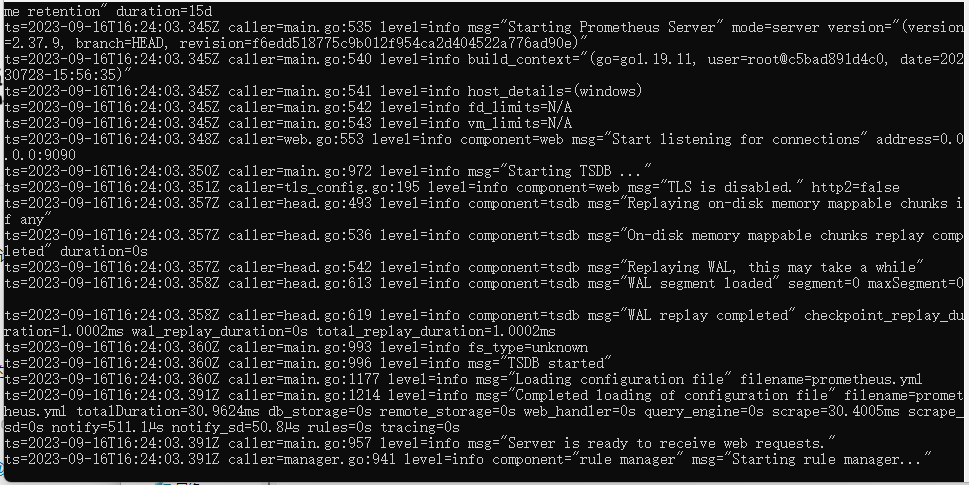

# Windows配置Prometheus 教程

## prometheus
### 下载Prometheus安装包
[prometheus]

[2.37.9-LTS]
[prometheus]: https://prometheus.io/download/
[2.37.9-LTS]: https://github.com/prometheus/prometheus/releases/download/v2.37.9/prometheus-2.37.9.windows-amd64.zip
### 启动Prometheus
解压安装包到指定目录

启动prometheus.exe程序

## export 
### widows_export

## grafana
### 下载Grafana安装包
### 启动Grafana
### 配置 Prometheus数据源

## alter
### 下载altermanager安装包
[altermanager]
[altermanager]: https://github.com/prometheus/alertmanager/releases/download/v0.26.0/alertmanager-0.26.0.windows-amd64.zip
### 启动altermanager

# Linux配置Prometheus教程
## prometheus
### 下载Prometheus安装包
### 启动Prometheus

## export 
### widows_export

## grafana
### 下载Grafana安装包
### 启动Grafana
### 配置 Prometheus数据源

## alter