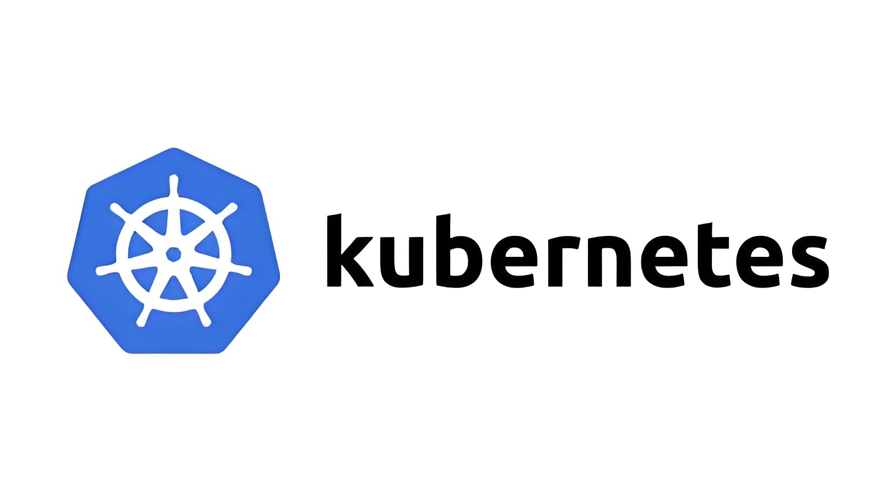

Kubernetes（常简称为 K8s）是一个开源的容器编排平台，用于自动部署、扩展和管理容器化应用程序。它提供了一个高度可扩展的平台，支持自动化容器的部署、调度、扩展、管理和监控，使得在大规模容器化环境中管理应用程序变得更加简单和高效。

以下是 Kubernetes 的一些关键概念和特点：

1. **容器化：** Kubernetes 基于容器技术，使用 Docker、containerd 等容器运行时来管理应用程序的打包、交付和运行。容器提供了一个独立的、隔离的运行时环境，使得应用程序在不同环境中保持一致性和可移植性。

2. **集群：** Kubernetes 将多个物理或虚拟机组合成一个集群（Cluster），用于管理和调度容器化应用程序。集群包含多个节点（Node），每个节点运行着 Kubernetes 组件和容器化应用程序。

3. **Master 节点：** Master 节点是 Kubernetes 集群的控制节点，负责管理和控制集群的运行状态。它包含多个核心组件，如 API Server、Controller Manager、Scheduler 等，用于接收 API 请求、调度 Pod、监控集群状态等。

4. **Worker 节点：** Worker 节点是 Kubernetes 集群的工作节点，用于运行容器化应用程序。每个 Worker 节点包含一个容器运行时（如 Docker）、kubelet（与 Master 节点通信）、kube-proxy（负责网络代理）等组件。

5. **Pod：** Pod 是 Kubernetes 中最小的部署单元，可以包含一个或多个紧密相关的容器。Pod 共享网络命名空间和存储卷，并且在同一节点上调度和管理。Pod 可以通过 ReplicaSet、Deployment 等控制器来管理。

6. **控制器：** 控制器是 Kubernetes 中的一种资源，用于管理和控制 Pod 的创建、更新和删除。常见的控制器包括 ReplicaSet、Deployment、StatefulSet、DaemonSet 等，它们根据配置规范自动维护 Pod 的数量和状态。

7. **服务发现和负载均衡：** Kubernetes 提供了一组服务发现和负载均衡的机制，使得应用程序可以轻松地通过服务名称进行通信，并且实现了负载均衡、故障转移等功能。

通过 Kubernetes，开发人员和运维人员可以轻松地部署、扩展和管理容器化应用程序，实现了基础设施的自动化和高可用性，提高了应用程序的可靠性和可扩展性。