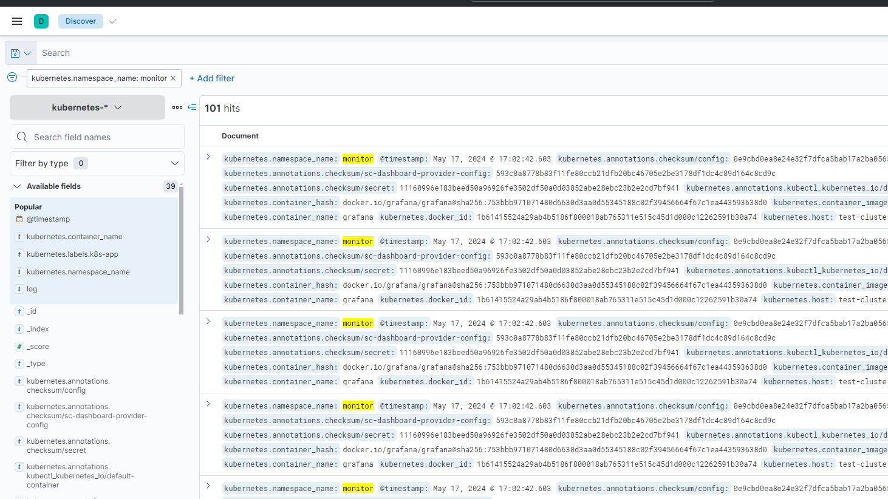

## 使用fluentbit 收集k8s pod log

## overview
https://docs.fluentbit.io/manual

## elasticsearch deploy in docker
```bash
docker network create elastic
docker pull docker.elastic.co/elasticsearch/elasticsearch:7.17.21
docker run -d --name elasticsearch --net elastic -p 9200:9200 -p 9300:9300 -e "discovery.type=single-node" -t docker.elastic.co/elasticsearch/elasticsearch:7.17.21
```

## kibana deploy in docker
```bash
docker pull docker.elastic.co/kibana/kibana:7.17.21
docker run -d --name kibana --net elastic -p 5601:5601 docker.elastic.co/kibana/kibana:7.17.21
```
## view elasticsearch+kibana


## fluentbit install yaml

```yaml
---
# fluentbit的配置文件
apiVersion: v1
kind: ConfigMap
metadata:
  name: fluent-bit-config
  namespace: logs
  labels:
    k8s-app: fluent-bit
data:
  # Configuration files: server, input, filters and output
  # ======================================================
  fluent-bit.conf: |
    [SERVICE]
        Flush         1
        Log_Level     info
        Daemon        off
        Parsers_File  parsers.conf
        HTTP_Server   On
        HTTP_Listen   0.0.0.0
        HTTP_Port     2020
 
    @INCLUDE input-kubernetes.conf
    @INCLUDE filter-kubernetes.conf
    @INCLUDE output-elasticsearch.conf
 
  input-kubernetes.conf: |
    [INPUT]
        Name              tail
        Tag               kube.*
        Path              /var/log/containers/*.log
        Parser            docker
        DB                /var/log/flb_kube.db
        Mem_Buf_Limit     5MB
        Skip_Long_Lines   On
        Refresh_Interval  10
 
  filter-kubernetes.conf: |
    [FILTER]
        Name                kubernetes
        Match               kube.*
        Kube_URL            https://kubernetes.default.svc:443
        Kube_CA_File        /var/run/secrets/kubernetes.io/serviceaccount/ca.crt
        Kube_Token_File     /var/run/secrets/kubernetes.io/serviceaccount/token
        Kube_Tag_Prefix     kube.var.log.containers.
        Merge_Log           On
        Merge_Log_Key       log_processed
        K8S-Logging.Parser  On
        K8S-Logging.Exclude Off
 
  output-elasticsearch.conf: |
    [OUTPUT]
        Name            es
        Match           *
        Host            10.224.122.36
        Port            9200
        HTTP_User elastic
        HTTP_Passwd 9YbX73x8q1Go2USZxJhj
        Logstash_Prefix kubernetes
        Logstash_DateFormat %Y.%m.%d
        Logstash_Format On
        Replace_Dots    On
        Retry_Limit     False
 
  parsers.conf: |
    [PARSER]
        Name   apache
        Format regex
        Regex  ^(?<host>[^ ]*) [^ ]* (?<user>[^ ]*) \[(?<time>[^\]]*)\] "(?<method>\S+)(?: +(?<path>[^\"]*?)(?: +\S*)?)?" (?<code>[^ ]*) (?<size>[^ ]*)(?: "(?<referer>[^\"]*)" "(?<agent>[^\"]*)")?$
        Time_Key time
        Time_Format %d/%b/%Y:%H:%M:%S %z
 
    [PARSER]
        Name   apache2
        Format regex
        Regex  ^(?<host>[^ ]*) [^ ]* (?<user>[^ ]*) \[(?<time>[^\]]*)\] "(?<method>\S+)(?: +(?<path>[^ ]*) +\S*)?" (?<code>[^ ]*) (?<size>[^ ]*)(?: "(?<referer>[^\"]*)" "(?<agent>[^\"]*)")?$
        Time_Key time
        Time_Format %d/%b/%Y:%H:%M:%S %z
 
    [PARSER]
        Name   apache_error
        Format regex
        Regex  ^\[[^ ]* (?<time>[^\]]*)\] \[(?<level>[^\]]*)\](?: \[pid (?<pid>[^\]]*)\])?( \[client (?<client>[^\]]*)\])? (?<message>.*)$
 
    [PARSER]
        Name   nginx
        Format regex
        Regex ^(?<remote>[^ ]*) (?<host>[^ ]*) (?<user>[^ ]*) \[(?<time>[^\]]*)\] "(?<method>\S+)(?: +(?<path>[^\"]*?)(?: +\S*)?)?" (?<code>[^ ]*) (?<size>[^ ]*)(?: "(?<referer>[^\"]*)" "(?<agent>[^\"]*)")?$
        Time_Key time
        Time_Format %d/%b/%Y:%H:%M:%S %z
 
    [PARSER]
        Name   json
        Format json
        Time_Key time
        Time_Format %d/%b/%Y:%H:%M:%S %z
 
    [PARSER]
        Name        docker
        Format      json
        Time_Key    time
        Time_Format %Y-%m-%dT%H:%M:%S.%L
        Time_Keep   On
 
    [PARSER]
        # http://rubular.com/r/tjUt3Awgg4
        Name cri
        Format regex
        Regex ^(?<time>[^ ]+) (?<stream>stdout|stderr) (?<logtag>[^ ]*) (?<message>.*)$
        Time_Key    time
        Time_Format %Y-%m-%dT%H:%M:%S.%L%z
 
    [PARSER]
        Name        syslog
        Format      regex
        Regex       ^\<(?<pri>[0-9]+)\>(?<time>[^ ]* {1,2}[^ ]* [^ ]*) (?<host>[^ ]*) (?<ident>[a-zA-Z0-9_\/\.\-]*)(?:\[(?<pid>[0-9]+)\])?(?:[^\:]*\:)? *(?<message>.*)$
        Time_Key    time
        Time_Format %b %d %H:%M:%S
---
# 配置fluentbit 角色权限
apiVersion: rbac.authorization.k8s.io/v1
kind: ClusterRoleBinding
metadata:
  name: fluent-bit-read
roleRef:
  apiGroup: rbac.authorization.k8s.io
  kind: ClusterRole
  name: fluent-bit-read
subjects:
- kind: ServiceAccount
  name: fluent-bit
  namespace: logs
 
 
---
# 配置fluentbit 角色权限
apiVersion: rbac.authorization.k8s.io/v1
kind: ClusterRole
metadata:
  name: fluent-bit-read
rules:
- apiGroups: [""]
  resources:
  - namespaces
  - pods
  verbs: ["get", "list", "watch"]
 
 
---
# fluent-bit-service-account 配置
apiVersion: v1
kind: ServiceAccount
metadata:
  name: fluent-bit
  namespace: logs
 
 
 
---
# fluent-bit daemonset 部署收集日志
apiVersion: apps/v1
kind: DaemonSet
metadata:
  name: fluent-bit
  namespace: logs
  labels:
    k8s-app: fluent-bit-logging
    version: v1
    kubernetes.io/cluster-service: "true"
spec:
  selector:
    matchLabels:
      k8s-app: fluent-bit-logging
  template:
    metadata:
      labels:
        k8s-app: fluent-bit-logging
        version: v1
        kubernetes.io/cluster-service: "true"
      annotations:
        prometheus.io/scrape: "true"
        prometheus.io/port: "2020"
        prometheus.io/path: /api/v1/metrics/prometheus
    spec:
      containers:
      - name: fluent-bit
        image: fluent/fluent-bit:1.5
        imagePullPolicy: Always
        ports:
          - containerPort: 2020
        env:
        - name: FLUENT_ELASTICSEARCH_HOST
          # 这里要填写连接的es的IP
          value: "49.65.125.91"
        - name: FLUENT_ELASTICSEARCH_PORT
          value: "9200"
        resources:
          limits:
            memory: 200Mi
          requests:
            cpu: 100m
            memory: 100Mi
        volumeMounts:
        - name: varlog
          mountPath: /var/log
        - name: varlibdockercontainers
          mountPath: /var/lib/docker/containers
          readOnly: true
        - name: fluent-bit-config
          mountPath: /fluent-bit/etc/
      terminationGracePeriodSeconds: 10
      volumes:
      - name: varlog
        hostPath:
          path: /var/log
      - name: varlibdockercontainers
        hostPath:
          path: /var/lib/docker/containers
      - name: fluent-bit-config
        configMap:
          name: fluent-bit-config
      serviceAccountName: fluent-bit
      tolerations:
      - key: node-role.kubernetes.io/master
        operator: Exists
        effect: NoSchedule
      - operator: "Exists"
        effect: "NoExecute"
      - operator: "Exists"
        effect: "NoSchedule"
```
## create index

## view kube logs
