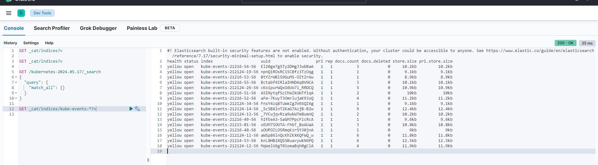
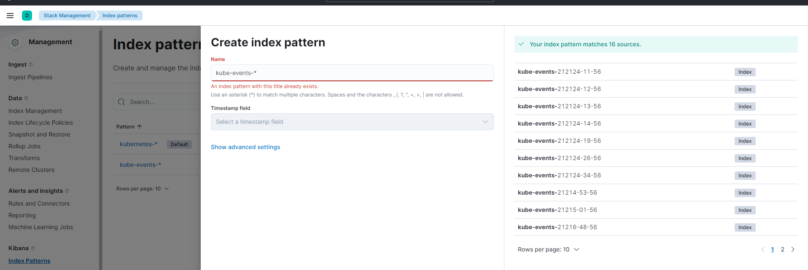
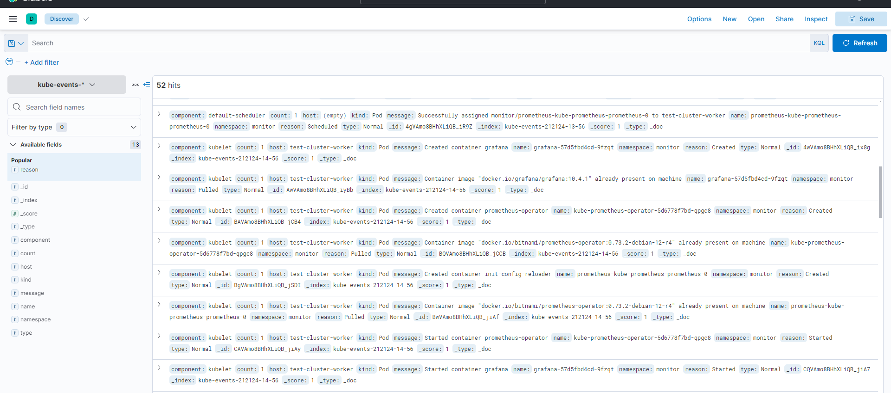

## overview
[kubernetes-event-exporter](https://github.com/resmoio/kubernetes-event-exporter)
## Install kubernetes-event-exporter

### Download chart locally
```bash
helm pull oci://registry-1.docker.io/bitnamicharts/kubernetes-event-exporter

root@docker-test-1:/home/ubuntu# ll charts/
-rw-r--r--  1 root   root   33291 May 16 01:08 kubernetes-event-exporter-3.0.5.tgz
tar -zxf kubernetes-event-exporter-3.0.5.tgz
cd kubernetes-event-exporter/
```
### Reference configuration
Update the configMap configuration in values.yaml
```bash
vim values.yaml
```

```yaml
config:
  logLevel: error
  logFormat: json
  route:
    routes:
    - match:
      - receiver: "es"  #  receivers name
  receivers:
  - name: "es"
    elasticsearch:
      hosts:
        - http://elasticsearch:9200  # es url
      index: kube-events
      indexFormat: "kube-events-{2024-05-16}"
      username: elasticsearch       # es user
      password: xxxxxxxxxxxx  # es password
      ## Example:
      layout:
        message: "{{ .Message }}"
        reason: "{{ .Reason }}"
        type: "{{ .Type }}"
        count: "{{ .Count }}"
        kind: "{{ .InvolvedObject.Kind }}"
        name: "{{ .InvolvedObject.Name }}"
        namespace: "{{ .Namespace }}"
        component: "{{ .Source.Component }}"
        host: "{{ .Source.Host }}"
      ##
      #layout: {}
```
### helm install kube-events

```bash
helm upgrade kube-events-exporter -n logs ./
```
### view pods
```bash
root@docker-test-1:/home/ubuntu# k get pods -n logs | grep events
kube-events-kubernetes-event-exporter-5bc8dbb5c8-qgvrs   1/1     Running   0               60m
root@docker-test-1:/home/ubuntu# 
```
### view pod logs
```bash
root@docker-test-1:/home/ubuntu# k logs -n logs kube-events-kubernetes-event-exporter-5bc8dbb5c8-qgvrs
{"level":"info","time":"2024-05-21T08:04:52Z","message":"Reading config file /data/config.yaml"}
{"level":"error","error":"pods \"grafana-57d5fbd4cd-wcqhk\" not found","time":"2024-05-21T08:24:11Z","message":"Object not found, likely deleted"}
{"level":"error","error":"pods \"kube-prometheus-operator-5d6778f7bd-5jxfs\" not found","time":"2024-05-21T08:24:11Z","message":"Object not found, likely deleted"}
{"level":"error","error":"pods \"grafana-57d5fbd4cd-wcqhk\" not found","time":"2024-05-21T08:24:12Z","message":"Object not found, likely deleted"}
root@docker-test-1:/home/ubuntu#
```

## view events in kibana
### login kibana to confirm
- Query index

- Create view

- view kube-events logs
